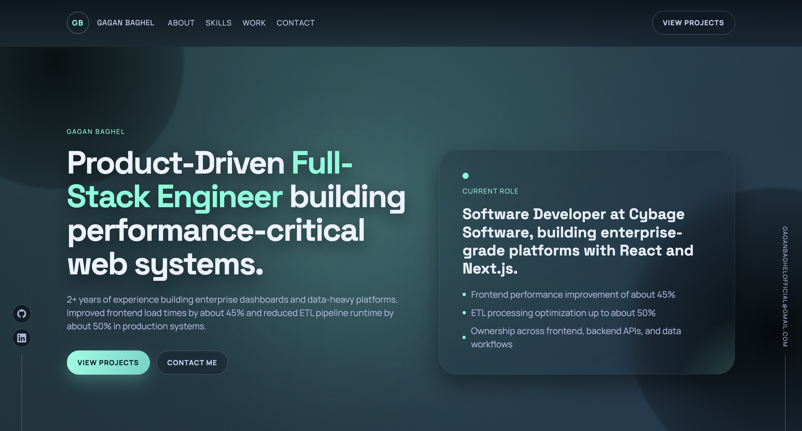

# Gagan Baghel | Full-Stack Software Engineer
A high-performance, product-driven portfolio built with modern web technologies. Focused on delivery impact, measurable performance gains, and premium user experiences.



## ✨ High-Impact Features

- **🚀 Performance Engineered**: Leverages Next.js App Router, optimized images (`next/image`), and code-splitting for sub-second load times.
- **🔍 End-to-End SEO**: Fully optimized with technical SEO best practices:
  - Dynamic `sitemap.xml` and `robots.txt`.
  - Comprehensive Open Graph (OG) and Twitter Card metadata.
  - Semantic HTML5 structure for accessibility and crawlers.
- **🎨 Premium UI/UX**: Distinctive aesthetics with:
  - Scattered glassmorphism and ambient gradients.
  - Interactive Canvas-based Skill Globe.
  - Smooth GSAP & Framer Motion micro-animations.
- **📱 Fluid Responsiveness**: Pixel-perfect layout across all device sizes.

## 🛠 Tech Stack

- **Frontend**: Next.js 14, React 18, Tailwind CSS.
- **Animations**: GSAP, Framer Motion, HTML5 Canvas.
- **Data**: Static & Dynamic project mapping via `site-data.js`.
- **Infrastructure**: Vercel-ready architecture.

## 📁 Project Structure

```text
├── app/               # Next.js App Router (Layouts, Pages, SEO)
├── components/        # Reusable UI components & Design system
├── public/            # Optimized assets (Logos, Previews)
├── next.config.js     # Optimized build & asset configuration
└── package.json       # Dependency management
```

## 🚀 Getting Started

1.  **Clone the repository**
2.  **Install dependencies**:
    ```bash
    npm install
    ```
3.  **Run development server**:
    ```bash
    npm run dev
    ```
4.  **Open [http://localhost:3000](http://localhost:3000)** to view the live build.

## 📫 Let's Connect

- **LinkedIn**: [Gagan Baghel](https://www.linkedin.com/in/gagan-singh-baghel-0a894220b/)
- **Email**: [gaganbaghelofficial@gmail.com](mailto:gaganbaghelofficial@gmail.com)
- **GitHub**: [@gagan-baghel](https://github.com/gagan-baghel)

---
*Designed + Engineered by Gagan Baghel*
